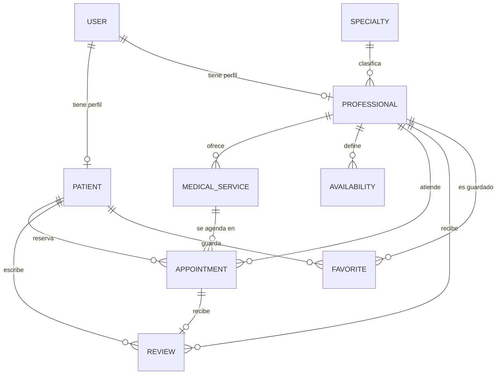

# 🩺 Salud al Toque — Backend

**Plataforma para encontrar y comparar profesionales de la salud según especialidad, precio, ubicación, disponibilidad y calificación.**

**Curso:** CS 2031 Desarrollo Basado en Plataforma

**Integrantes:**
- Alvaro David Pachas Chapeton (202510345)
- Fabricio Alberto Olaguibel Romero (202410686)
- Saul Morales Zumaeta (202010493)
- Alexander Muñoz Zamora (202210475)

**Deployment:** `[]`

---

## Índice

1. [Introducción](#1-introducción)
2. [Identificación del Problema](#2-identificación-del-problema)
3. [Descripción de la Solución](#3-descripción-de-la-solución)
4. [Arquitectura y Decisiones de Diseño](#4-arquitectura-y-decisiones-de-diseño)
5. [Modelo de Entidades](#5-modelo-de-entidades)
6. [Endpoints](#6-endpoints)
7. [Manejo de Errores](#7-manejo-de-errores)
8. [Medidas de Seguridad](#8-medidas-de-seguridad)
9. [Eventos y Asincronía](#9-eventos-y-asincronía)
10. [Ejecución Local y Variables de Entorno](#10-ejecución-local-y-variables-de-entorno)
11. [GitHub & Management](#11-github--management)
12. [Conclusión](#12-conclusión)
13. [Apéndices](#13-apéndices)

---

## 1. Introducción

### Contexto
En Lima, muchas personas buscan atención médica, odontológica o psicológica particular porque el sistema público está saturado. Sin embargo, la información sobre profesionales privados está dispersa entre redes sociales, recomendaciones y llamadas telefónicas, y comparar precio, ubicación y horarios es lento.

### Objetivos del Proyecto
- Permitir a pacientes buscar y filtrar profesionales por especialidad, ubicación, precio máximo y calificación mínima.
- Permitir a profesionales publicar sus servicios con precio y sus horarios de atención.
- Gestionar la reserva de citas evitando la doble reserva de un mismo horario.
- Generar confianza mediante reseñas verificadas (solo de citas completadas).
- Notificar por correo, de forma asíncrona, los eventos importantes del flujo.

## 2. Identificación del Problema

### Descripción del Problema
Los pacientes no tienen un lugar único donde comparar profesionales de salud privados según su presupuesto, cercanía y disponibilidad. A la vez, los profesionales independientes tienen dificultades para llegar a nuevos pacientes y administrar su agenda sin cruces de horario.

### Justificación
Reducir el tiempo de búsqueda de atención mejora el acceso a la salud. Un sistema de reservas con validación de disponibilidad elimina conflictos de horario, y las reseñas asociadas a citas reales ayudan a tomar decisiones informadas.

## 3. Descripción de la Solución

### Funcionalidades Implementadas
| Funcionalidad | Cómo contribuye |
|---|---|
| Registro e inicio de sesión (JWT) | Acceso seguro con contraseñas cifradas y token con expiración. |
| Roles `ADMIN`, `PROFESSIONAL`, `PATIENT` | Cada actor solo ve y modifica lo que le corresponde. |
| Búsqueda con filtros (`specialty`, `location`, `maxPrice`) | Resuelve directamente la comparación de profesionales. |
| Servicios médicos con precio | El paciente conoce el costo antes de reservar; la cita guarda el precio como snapshot. |
| Disponibilidad semanal | El profesional define bloques horarios; las citas fuera de ellos se rechazan. |
| Citas con ciclo de vida | `PENDIENTE → ACEPTADA → COMPLETADA` o `RECHAZADA`. Un horario ocupado no puede reservarse de nuevo (409). |
| Reseñas | Solo sobre citas completadas propias; recalculan el rating del profesional. |
| Favoritos | El paciente guarda profesionales para volver a consultarlos. |
| Notificaciones por correo | Bienvenida, confirmación de cita al paciente y al profesional, y nueva reseña, con plantillas Thymeleaf. |

### Tecnologías Utilizadas
- **Lenguaje y framework:** Java 17, Spring Boot 4 (Web MVC, Data JPA, Security, Validation, Mail, Thymeleaf).
- **Base de datos:** PostgreSQL 16 (Docker Compose en local).
- **Seguridad:** Spring Security, JJWT 0.12, BCrypt.
- **Pruebas:** JUnit 5, Mockito, MockMvc, Testcontainers.
- **Herramientas:** Maven, Lombok, Postman, Mailpit (SMTP de desarrollo), GitHub Actions.

## 4. Arquitectura y Decisiones de Diseño

El código se organiza **por módulo de dominio** (`user`, `patient`, `professional`, `specialty`, `medicalservice`, `availability`, `appointment`, `review`, `favorite`, `auth`), y cada módulo tiene las mismas capas:

```
application/     → @RestController: recibe DTOs validados y devuelve ResponseEntity
domain/          → entidades JPA y @Service con toda la lógica de negocio
infrastructure/  → repositorios Spring Data JPA
dto/             → Request DTOs (entrada) y Response DTOs (salida, con fromEntity)
```

Decisiones principales:
- **Capas separadas:** los controllers exponen la API, los services concentran el acceso a datos y los repositorios encapsulan las consultas JPA.
- **Usuario desde el token:** el profesional o paciente se obtiene del JWT autenticado; nunca se confía en un `professionalId` o `patientId` enviado por el cliente.
- **DTOs de entrada y salida:** las respuestas nunca exponen entidades ni contraseñas.
- **Inyección por constructor** en todos los componentes; ningún componente de Spring se instancia con `new`.

## 5. Modelo de Entidades



| Entidad | Atributos principales | Notas |
|---|---|---|
| `User` | name, email (único), password (BCrypt), phone, role | Restricciones `nullable`, `unique` y `length`. |
| `Patient` | address, dateOfBirth, user | `@OneToOne` con `User`. |
| `Professional` | location, rating, user, specialty | `@OneToMany` a sus servicios médicos. |
| `Specialty` | name (único) | Catálogo administrado por ADMIN. |
| `MedicalService` | name, description, price | Pertenece a un profesional. |
| `Availability` | dayOfWeek, startTime, endTime | Bloques semanales por profesional. |
| `Appointment` | date, time, status, notes, price | Guarda el precio del servicio como snapshot. |
| `Review` | rating, comment, appointment (única) | Una reseña por cita. |
| `Favorite` | patient, professional | Restricción única `(patient_id, professional_id)`. |

Las columnas obligatorias usan `nullable = false`, el email y el nombre de especialidad son únicos y los favoritos tienen restricción única `(patient_id, professional_id)`. En la capa de aplicación se valida con `@Valid`, `@NotBlank`, `@Email`, `@Pattern`, `@Min`, `@Max` y `@Size`.

## 6. Endpoints

La colección completa, con ejemplos y variables, está en [`postman_collection.json`](postman_collection.json).

| Recurso | Endpoints |
|---|---|
| Auth (público) | `POST /auth/signup`, `POST /auth/signin` |
| Users (ADMIN) | `GET /users`, `GET /users/{id}`, `POST /users`, `DELETE /users/{id}` |
| Patients | PATIENT: `GET /patients/me`; ADMIN: `GET /patients`, `GET /patients/{id}`, `POST /patients`, `DELETE /patients/{id}` |
| Professionals | Público: `GET /professionals?specialty=&location=&maxPrice=`, `GET /professionals/{id}`; ADMIN: `POST`, `PUT /{id}`, `DELETE /{id}` |
| Specialties | Público: `GET`, `GET /{id}`; ADMIN: `POST`, `DELETE /{id}` |
| Medical services | Público: `GET`, `GET /{id}`, `GET /professional/{id}`; PROFESSIONAL (dueño): `POST`, `DELETE /{id}` |
| Availabilities | Público: `GET`, `GET /{id}`, `GET /professional/{id}`; PROFESSIONAL (dueño): `POST`, `DELETE /{id}` |
| Appointments | PATIENT: `POST`, `GET /my-appointments`; PROFESSIONAL: `GET /my-professional-appointments`, `PATCH /{id}/accept`, `/reject`, `/complete`; ADMIN: `GET`, `GET /{id}`, `GET /patient/{id}`, `GET /professional/{id}`, `DELETE /{id}` |
| Reviews | Público: `GET`, `GET /{id}`, `GET /professional/{id}`; PATIENT: `POST` |
| Favorites | PATIENT: `GET /my-favorites`, `POST /professional/{id}`, `DELETE /{id}` |

## 7. Manejo de Errores

Un `@RestControllerAdvice` (`GlobalExceptionHandler`) centraliza todos los errores y responde siempre con el mismo `ErrorResponseDTO`:

```json
{ "timestamp": "2026-09-25T21:00:00", "status": 409, "error": "Conflict",
  "message": "El horario seleccionado ya está reservado", "path": "/appointments", "fieldErrors": null }
```

Excepciones personalizadas, organizadas en jerarquía sobre `ApiException` (que lleva su `HttpStatus`):

| Categoría (status) | Excepciones |
|---|---|
| 400 Bad Request | `BadRequestException`, `InvalidFormatException` |
| 401 Unauthorized | `UnauthorizedException`, `InvalidTokenException` |
| 403 Forbidden | `ForbiddenException`, `ResourceOwnershipException`, `InvalidOperationException` |
| 404 Not Found | `ResourceNotFoundException` |
| 409 Conflict | `ConflictException`, `DuplicateResourceException`, `SlotUnavailableException`, `InvalidStatusTransitionException` |

También se manejan excepciones de Spring: `MethodArgumentNotValidException` (400 con `fieldErrors` por campo), `HttpMessageNotReadableException`, `MethodArgumentTypeMismatchException`, `MissingServletRequestParameterException` (400), `AuthenticationException` (401), `AccessDeniedException` (403), `NoResourceFoundException` (404), `HttpRequestMethodNotSupportedException` (405), `DataIntegrityViolationException` (409) y cualquier otra como 500, que se registra en el log sin exponer detalles internos. Los accesos sin token o sin permisos se responden con 401 y 403 desde la configuración de Spring Security.

Manejar los errores de forma global evita respuestas inconsistentes, filtra información sensible (stack traces) y permite que el frontend reaccione según el código HTTP.

## 8. Medidas de Seguridad

### Seguridad de Datos
- **Autenticación JWT stateless:** el login y el registro devuelven un token firmado (HS256) con expiración de 1 hora. `JwtAuthorizationFilter` extrae el token del header `Authorization: Bearer`, valida firma y expiración y carga el usuario con `CustomUserDetailsService`, dejándolo en el `SecurityContext`.
- **Contraseñas con BCrypt**, con política de contraseña fuerte en el registro (8–64 caracteres, letras y números) y email único.
- **Autorización por roles** guardados en BD: `@PreAuthorize` en cada endpoint sensible y, además, verificación de propiedad (un profesional solo modifica sus servicios, horarios y citas; un paciente solo sus reseñas y favoritos).
- **Configuración sensible por variables de entorno:** credenciales de BD y SMTP. `.env` no se sube al repositorio.

### Prevención de Vulnerabilidades
- **Inyección SQL:** todo el acceso a datos usa Spring Data JPA con consultas parametrizadas; no se concatena SQL.
- **Validación de entrada:** Bean Validation en los requests de autenticación, citas y reseñas; los datos inválidos se rechazan con 400.
- **CSRF:** deshabilitado de forma intencional porque la API es stateless y no usa cookies de sesión.
- **XSS:** la API solo responde JSON y las plantillas de correo Thymeleaf escapan el contenido con `th:text`.

## 9. Eventos y Asincronía

| Evento | Publicado en | Listener y efecto |
|---|---|---|
| `UserRegisteredEvent` | `AuthService.signUp` | Correo de bienvenida. |
| `AppointmentCreatedEvent` | creación de cita | Confirmación al paciente y aviso al profesional. |
| `ReviewCreatedEvent` | creación de reseña | Aviso al profesional de la nueva reseña. |

Los listeners usan `@EventListener` y `@Async("notificationExecutor")`. `AsyncConfig` (`@EnableAsync`) define un `ThreadPoolTaskExecutor` (2–5 hilos, cola de 100, prefijo `notification-`).

**¿Por qué asíncronos?** Enviar un correo por SMTP puede tardar segundos o fallar. Si fuera síncrono, el paciente esperaría esa latencia al reservar y un fallo del servidor de correo haría fallar la reserva. Con eventos, los services no dependen del módulo de notificaciones (bajo acoplamiento), y los errores de envío se registran sin afectar la operación principal.

## 10. Ejecución Local y Variables de Entorno

```bash
docker compose up -d                 # PostgreSQL en el puerto 5434
docker run -d -p 1025:1025 -p 8025:8025 axllent/mailpit   # correos en http://localhost:8025
./mvnw spring-boot:run               # API en http://localhost:8080
./mvnw verify                        # pruebas (requiere Docker por Testcontainers)
```

Usuarios de prueba (`data.sql`, contraseña `123456`): `admin@gmail.com`, `carlos@gmail.com` (profesional), `luis@gmail.com` (paciente).

| Variable | Uso |
|---|---|
| `DB_HOST`, `DB_PORT`, `DB_NAME`, `DB_USER`, `DB_PASSWORD` | Conexión a PostgreSQL |
| `NOTIFICATION_EMAIL_ENABLED`, `MAIL_HOST`, `MAIL_PORT`, `MAIL_USERNAME`, `MAIL_PASSWORD` | SMTP |

## 11. GitHub & Management

- **Gestión de tareas:** `[completar: describir el tablero de GitHub Projects, issues asignadas por integrante, labels y milestones por semana]`.
- **Flujo de ramas:** `[completar: ramas feature/* y pull requests hacia main con revisión]`.
- **GitHub Actions:** `[completar: describir el workflow si se configura; si no, indicarlo como trabajo futuro]`.

## 12. Conclusión

### Logros del Proyecto
Se construyó un backend completo que permite buscar y comparar profesionales, reservar citas sin conflictos de horario, gestionar su ciclo de vida, reseñar atenciones reales y recibir notificaciones asíncronas, con seguridad por roles y una API REST versionada y documentada.

### Aprendizajes Clave
- Separar controller, service y repository simplifica las pruebas y el mantenimiento.
- Los DTOs protegen el modelo de persistencia y evitan fugas de datos.
- La autorización no termina en el rol: también hay que verificar la propiedad de cada recurso.
- Los eventos y `@Async` desacoplan módulos y mejoran los tiempos de respuesta.

### Trabajo Futuro
- Refresh tokens y versionado de la API (`/api/v1`).
- Cancelación de citas por el paciente y filtro por calificación mínima.
- Paginación y ordenamiento en los listados.
- Documentación Swagger/OpenAPI.
- Integración con Google Maps para búsqueda por cercanía.
- Recordatorios programados de citas y subida de fotos de perfil a S3.
- Despliegue con CD automático.

## 13. Apéndices

### Licencia
MIT.

### Referencias
- Documentación oficial de Spring Boot, Spring Security y Spring Data JPA — https://docs.spring.io
- JJWT — https://github.com/jwtk/jjwt
- Testcontainers — https://testcontainers.com
- OWASP Top 10 — https://owasp.org/www-project-top-ten/
- Material y laboratorios del curso CS 2031 (semanas 4 y 6).
