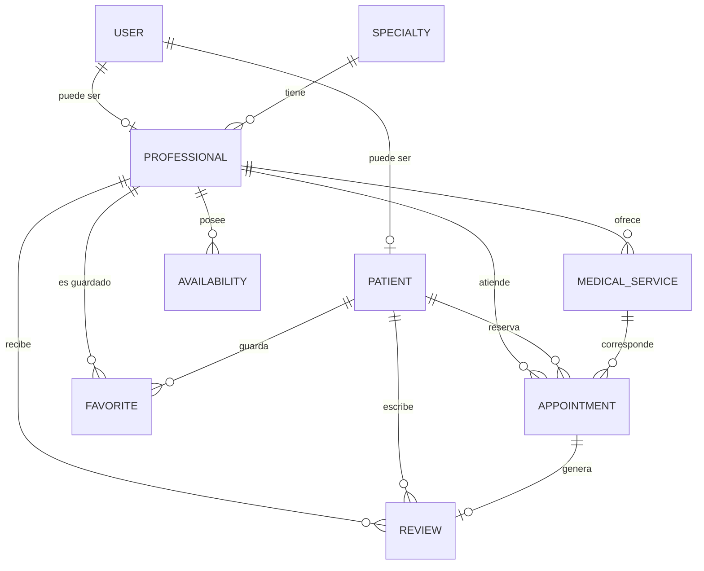

# 🩺 Salud al Toque

## Proyecto Final — CS 2031 Desarrollo Basado en Plataforma

**Curso:** CS 2031 Desarrollo Basado en Plataforma  
**Proyecto:** Salud al Toque  

**Backend:** Java + Spring Boot  
**Base de datos:** PostgreSQL  
**Integrantes:** 
- Alvaro David Pachas Chapeton
- Fabricio Alberto Olaguibel Romero
- Saul Morales Zumaeta
- Alexander Muñoz Zamora  
---

## Índice

1. [Introducción](#introducción)
2. [Identificación del Problema](#identificación-del-problema)
3. [Descripción de la Solución](#descripción-de-la-solución)
4. [Arquitectura del Proyecto](#arquitectura-del-proyecto)
5. [Modelo de Entidades](#modelo-de-entidades)
6. [DTOs y Mapeo](#dtos-y-mapeo)
7. [API REST y Endpoints](#api-rest-y-endpoints)
8. [Manejo de Errores](#manejo-de-errores)
9. [Seguridad y Autenticación](#seguridad-y-autenticación)
10. [Base de Datos y Ejecución](#base-de-datos-y-ejecución)
11. [Pruebas](#pruebas)
12. [GitHub y Gestión del Proyecto](#github-y-gestión-del-proyecto)
13. [Conclusiones y Trabajo Futuro](#conclusiones-y-trabajo-futuro)
14. [Apéndices](#apéndices)

---

# 1. Introducción

## Contexto

Salud al Toque es una plataforma orientada a facilitar la búsqueda y gestión de servicios médicos. El sistema busca conectar pacientes con profesionales de la salud, permitiendo consultar información profesional, especialidades, servicios médicos, disponibilidad y gestionar citas.

El backend fue desarrollado como una API REST utilizando Java y Spring Boot. La aplicación administra usuarios con diferentes roles, profesionales, pacientes, servicios médicos, especialidades, citas, disponibilidades, reseñas y favoritos.

## Objetivos del Proyecto

Los principales objetivos son:

- Permitir el registro y autenticación de usuarios.
- Gestionar pacientes y profesionales de la salud.
- Permitir consultar profesionales por especialidad, ubicación y precio.
- Gestionar los servicios ofrecidos por cada profesional.
- Registrar la disponibilidad de los profesionales.
- Permitir la creación y gestión de citas médicas.
- Permitir que los pacientes registren reseñas.
- Permitir guardar profesionales como favoritos.
- Proteger los recursos mediante autenticación y autorización.
- Mantener una arquitectura organizada y escalable.

---

# 2. Identificación del Problema

## Descripción del Problema

Encontrar profesionales de la salud y coordinar una atención puede requerir consultar diferentes fuentes de información. Además, el paciente necesita conocer datos como especialidad, ubicación, servicios disponibles, precios, horarios y valoración del profesional antes de solicitar una cita.

Desde el punto de vista del profesional, también es necesario administrar sus servicios, disponibilidad y citas.

## Justificación

Salud al Toque centraliza estas operaciones en una sola plataforma. De esta manera, el paciente puede consultar profesionales y servicios y posteriormente gestionar sus citas desde el mismo sistema.

La separación entre pacientes, profesionales, servicios, disponibilidad y citas permite representar de manera estructurada las relaciones existentes en el dominio.

---

# 3. Descripción de la Solución

## Funcionalidades Implementadas

### Autenticación

El sistema permite:

- Registro de pacientes.
- Inicio de sesión.
- Generación de tokens JWT.
- Validación de tokens.
- Autorización según roles.

### Gestión de profesionales

Los usuarios pueden consultar profesionales y aplicar filtros por:

- Especialidad.
- Ubicación.
- Precio máximo.

Cada profesional está relacionado con un usuario, una especialidad y sus servicios médicos.

### Servicios médicos

Cada profesional puede administrar los servicios médicos que ofrece. Los servicios contienen:

- Nombre.
- Descripción.
- Precio.
- Profesional asociado.

El precio de un servicio se almacena también en la cita cuando esta se genera, funcionando como un registro histórico del precio utilizado en dicha reserva.

### Disponibilidad

Los profesionales pueden registrar sus horarios de atención indicando:

- Día de la semana.
- Hora de inicio.
- Hora de finalización.

### Citas

Las citas relacionan:

- Paciente.
- Profesional.
- Servicio médico.
- Fecha.
- Hora.
- Estado.
- Notas.
- Precio.

Además, se implementa una validación para evitar la duplicación de una cita para el mismo profesional, fecha y hora.

### Reseñas

Los pacientes pueden registrar reseñas asociadas a una cita completada. Las reseñas contienen una calificación y un comentario y se relacionan con el paciente, profesional y cita correspondiente.

### Favoritos

Los pacientes pueden guardar profesionales como favoritos. Se evita que un mismo paciente registre dos veces al mismo profesional como favorito mediante una restricción de unicidad.

---

# 4. Arquitectura del Proyecto

El backend utiliza una arquitectura organizada por funcionalidades, separando responsabilidades entre aplicación, dominio, DTO e infraestructura.

```text
src/main/java/com/example/sss001/

├── config/
│   └── SecurityConfig.java
│
├── auth/
│   ├── application/
│   ├── components/
│   ├── domain/
│   └── dto/
│
├── user/
│   ├── application/
│   ├── domain/
│   ├── dto/
│   └── infrastructure/
│
├── professional/
├── patient/
├── appointment/
├── specialty/
├── medicalservice/
├── availability/
├── review/
└── favorite/
```

Cada módulo contiene sus propios componentes. Los controllers reciben las solicitudes HTTP, los services contienen la lógica de negocio y los repositories realizan el acceso a la base de datos.

Esta separación sigue el patrón general:

```text
Controller
    ↓
Service / Domain
    ↓
Repository
    ↓
PostgreSQL
```

La inyección de dependencias se realiza mediante constructores, reduciendo el acoplamiento entre componentes.

---

# 5. Modelo de Entidades

El sistema actualmente cuenta con las siguientes entidades principales:

| Entidad | Descripción |
|---|---|
| `User` | Información y credenciales del usuario |
| `Patient` | Información adicional del paciente |
| `Professional` | Información del profesional |
| `Specialty` | Especialidad médica |
| `MedicalService` | Servicio ofrecido por un profesional |
| `Appointment` | Cita médica |
| `Availability` | Horario disponible |
| `Review` | Reseña de un profesional |
| `Favorite` | Profesional guardado por un paciente |

## Relaciones principales



Las relaciones se implementan mediante anotaciones JPA como `@OneToOne`, `@OneToMany` y `@ManyToOne`.

La entidad `Favorite` incorpora además una restricción de unicidad sobre la combinación `patient_id` y `professional_id`.

---

# 6. DTOs y Mapeo

El proyecto utiliza DTOs para evitar exponer directamente las entidades JPA en los endpoints.

Entre los DTO implementados se encuentran:

- `UserDTO`
- `ProfessionalDTO`
- `PatientDTO`
- `AppointmentDTO`
- `CreateAppointmentRequest`
- `SpecialtyDTO`
- `MedicalServiceDTO`
- `AvailabilityDTO`
- `ReviewDTO`
- `CreateReviewRequest`
- `FavoriteDTO`
- `SignInRequest`
- `SignUpRequest`
- `TokenResponse`

Esta separación permite definir estructuras específicas para las solicitudes y respuestas de la API.

Por ejemplo, las contraseñas de los usuarios no forman parte de `UserDTO`, evitando exponer información sensible.

Para algunas operaciones se utiliza ModelMapper, mientras que determinadas conversiones se realizan directamente en los servicios.

---

# 7. API REST y Endpoints

La API utiliza recursos en plural y verbos HTTP de acuerdo con las operaciones realizadas.

## Autenticación

| Método | Endpoint | Descripción |
|---|---|---|
| `POST` | `/auth/signup` | Registrar paciente |
| `POST` | `/auth/signin` | Iniciar sesión |

## Usuarios

| Método | Endpoint | Descripción |
|---|---|---|
| `GET` | `/users` | Listar usuarios |
| `GET` | `/users/{id}` | Obtener usuario |

## Profesionales

| Método | Endpoint | Descripción |
|---|---|---|
| `GET` | `/professionals` | Listar y buscar profesionales |
| `GET` | `/professionals/{id}` | Obtener profesional |

Los filtros disponibles incluyen:

```text
/professionals?specialty=Cardiologia
/professionals?location=Lima
/professionals?maxPrice=80
```

También pueden combinarse.

## Pacientes

| Método | Endpoint | Descripción |
|---|---|---|
| `GET` | `/patients` | Consultar pacientes |
| `GET` | `/patients/{id}` | Obtener paciente |
| `GET` | `/patients/me` | Obtener información del paciente autenticado |

## Especialidades

| Método | Endpoint | Descripción |
|---|---|---|
| `GET` | `/specialties` | Listar especialidades |
| `GET` | `/specialties/{id}` | Obtener especialidad |

## Servicios médicos

| Método | Endpoint | Descripción |
|---|---|---|
| `GET` | `/medical-services` | Listar servicios |
| `GET` | `/medical-services/{id}` | Obtener servicio |
| `POST` | `/medical-services` | Crear servicio |

## Disponibilidad

| Método | Endpoint | Descripción |
|---|---|---|
| `GET` | `/availabilities` | Listar disponibilidades |
| `GET` | `/availabilities/{id}` | Obtener disponibilidad |
| `POST` | `/availabilities` | Crear disponibilidad |

## Citas

| Método | Endpoint | Descripción |
|---|---|---|
| `GET` | `/appointments` | Consultar citas según permisos |
| `GET` | `/appointments/{id}` | Obtener cita |
| `POST` | `/appointments` | Crear cita |

El acceso a las citas se encuentra protegido para evitar que un paciente consulte información perteneciente a otros usuarios.

## Reseñas

| Método | Endpoint | Descripción |
|---|---|---|
| `GET` | `/reviews` | Listar reseñas |
| `GET` | `/reviews/{id}` | Obtener reseña |
| `POST` | `/reviews` | Crear reseña |

## Favoritos

| Método | Endpoint | Descripción |
|---|---|---|
| `GET` | `/favorites` | Obtener favoritos |
| `POST` | `/favorites` | Agregar favorito |
| `DELETE` | `/favorites/{id}` | Eliminar favorito |

---

# 8. Manejo de Errores

El proyecto cuenta con un `GlobalExceptionHandler` basado en `@ControllerAdvice`.

Se implementaron excepciones personalizadas como:

- `ResourceNotFoundException`
- `ForbiddenException`
- `ConflictException`

Además, el sistema maneja excepciones de Spring Security y errores relacionados con solicitudes HTTP.

Los principales códigos utilizados son:

| Código | Significado |
|---|---|
| `200` | Operación exitosa |
| `400` | Solicitud inválida |
| `401` | Usuario no autenticado |
| `403` | Usuario autenticado sin permisos |
| `404` | Recurso inexistente |
| `409` | Conflicto |
| `500` | Error interno |

Un ejemplo importante es la diferencia entre `401` y `403`: un usuario sin token no está autenticado, mientras que un usuario autenticado puede ser rechazado cuando intenta ejecutar una operación que su rol no permite.

---

# 9. Seguridad y Autenticación

La aplicación utiliza Spring Security junto con JWT.

El proceso de autenticación es:

```text
Usuario
   ↓
POST /auth/signin
   ↓
AuthenticationManager
   ↓
Validación de email/password
   ↓
JwtService
   ↓
Token JWT
```

Posteriormente, el cliente envía:

```text
Authorization: Bearer <token>
```

El `JwtAuthorizationFilter` intercepta la solicitud, valida el token y obtiene el usuario correspondiente mediante `CustomUserDetailsService`.

Las contraseñas son almacenadas utilizando `BCryptPasswordEncoder`.

Actualmente existen roles como:

```text
PATIENT
PROFESSIONAL
ADMIN
```

La autorización se utiliza para restringir operaciones sensibles. Por ejemplo, un paciente no puede crear disponibilidades o servicios médicos de un profesional.

La configuración utiliza sesiones `STATELESS`, por lo que la autenticación se basa en los tokens.

La clave JWT está configurada mediante una propiedad de aplicación y está preparada para utilizar variables de entorno en la configuración.

---

# 10. Base de Datos y Ejecución

El proyecto utiliza PostgreSQL y Docker Compose para facilitar el desarrollo local.

El contenedor utilizado es:

```text
postgres:16-alpine
```

La aplicación se conecta mediante:

```properties
spring.datasource.url=jdbc:postgresql://${DB_HOST:localhost}:${DB_PORT:5434}/${DB_NAME:sss001}
```

Para iniciar la base de datos:

```bash
docker compose up -d
```

Para ejecutar el backend:

```bash
./mvnw spring-boot:run
```

También puede ejecutarse directamente desde IntelliJ IDEA.

La aplicación utiliza `data.sql` para cargar datos iniciales de prueba, incluyendo usuarios, profesionales, especialidades, servicios, disponibilidad y una cita inicial.

---

# 11. Pruebas

Durante el desarrollo se implementaron pruebas de diferentes niveles utilizando Spring Boot Test, MockMvc y Testcontainers.

Entre las pruebas desarrolladas se encuentran:

- `AuthServiceTest`
- `FavoriteServiceTest`
- `AppointmentRepositoryTest`
- `FavoriteRepositoryTest`
- `ReviewRepositoryTest`
- `AvailabilityRepositoryTest`
- `AppointmentControllerTest`
- `FavoriteControllerTest`
- `ReviewControllerTest`
- `MedicalServiceControllerTest`
- `AvailabilityControllerTest`
- `ProfessionalControllerTest`
- `PatientControllerTest`
- `UserControllerTest`
- `SpecialtyControllerTest`

Las pruebas utilizan PostgreSQL mediante Testcontainers para acercar el entorno de testing al entorno real de ejecución.

El objetivo de estas pruebas es verificar tanto el funcionamiento esperado como los errores de autenticación, autorización, recursos inexistentes y conflictos de negocio.

---

# 12. GitHub y Gestión del Proyecto

El desarrollo del proyecto se realiza mediante Git y GitHub.

El repositorio permite mantener el historial de cambios y organizar la evolución del backend.

Como referencia para el desarrollo se utilizaron los laboratorios oficiales del curso, especialmente:

- Semana 04: testing con Spring Boot.
- Semana 06: Spring Security, JWT y roles/autorización.

La documentación del proyecto se mantiene en `README.md`, mientras que la API será documentada mediante una colección de Postman ubicada en la raíz del repositorio.

---

# 13. Conclusiones y Trabajo Futuro

## Logros del Proyecto

Se desarrolló un backend funcional para una plataforma de servicios médicos, incorporando:

- Arquitectura modular.
- Persistencia con JPA.
- PostgreSQL.
- API REST.
- DTOs.
- Autenticación JWT.
- Spring Security.
- Roles y autorización.
- Manejo global de excepciones.
- Gestión de pacientes y profesionales.
- Citas médicas.
- Servicios y disponibilidad.
- Reseñas.
- Favoritos.
- Pruebas automatizadas.

La solución permite representar las principales operaciones del dominio de Salud al Toque y proporciona una base preparada para ser consumida por una aplicación web o móvil.

## Aprendizajes Clave

El desarrollo permitió aplicar conceptos de arquitectura en capas, persistencia con JPA, diseño de APIs REST, seguridad mediante JWT, manejo de excepciones y pruebas automatizadas.

También permitió comprender la importancia de separar las entidades de persistencia de los objetos utilizados por la API mediante DTOs.

## Trabajo Futuro

Entre las mejoras previstas se encuentran:

- Implementar eventos de dominio y procesamiento asíncrono.
- Incorporar servicio de correo electrónico.
- Añadir refresh tokens.
- Mejorar las validaciones mediante Bean Validation.
- Implementar paginación.
- Añadir versionado de API.
- Incorporar Swagger/OpenAPI.
- Configurar CI/CD mediante GitHub Actions.
- Desplegar el backend en una plataforma cloud.
- Implementar una colección Postman completa con variables y ejemplos.
- Mejorar la gestión de permisos mediante `@PreAuthorize`.
- Incorporar un sistema más completo de administración.

---

# 14. Apéndices

## A. Licencia

Actualmente la licencia del proyecto debe ser definida por el equipo.

**Licencia:** [Completar]

## B. Referencias

- CS 2031 — Desarrollo Basado en Plataforma.
- Laboratorio Semana 04 — Testing con Spring Boot.
- Laboratorio Semana 06 — Spring Security, JWT y roles/autorización.
- Documentación oficial de Spring Boot.
- Documentación oficial de Spring Security.
- Documentación de PostgreSQL.
- Documentación de Testcontainers.

## C. Variables de Entorno

Para producción se recomienda configurar los valores sensibles mediante variables de entorno:

```text
DB_HOST
DB_PORT
DB_NAME
DB_USER
DB_PASSWORD
JWT_SECRET
JWT_EXPIRATION
```

No se deben almacenar contraseñas, claves JWT u otras credenciales directamente en el repositorio.

---

## Estado actual del proyecto

El backend se encuentra funcional para las operaciones principales del dominio. Algunos elementos solicitados por la rúbrica, como eventos, procesamiento asíncrono, correo electrónico, deployment cloud, CI/CD y ciertas validaciones avanzadas, quedan identificados como trabajo futuro y podrán incorporarse posteriormente.
