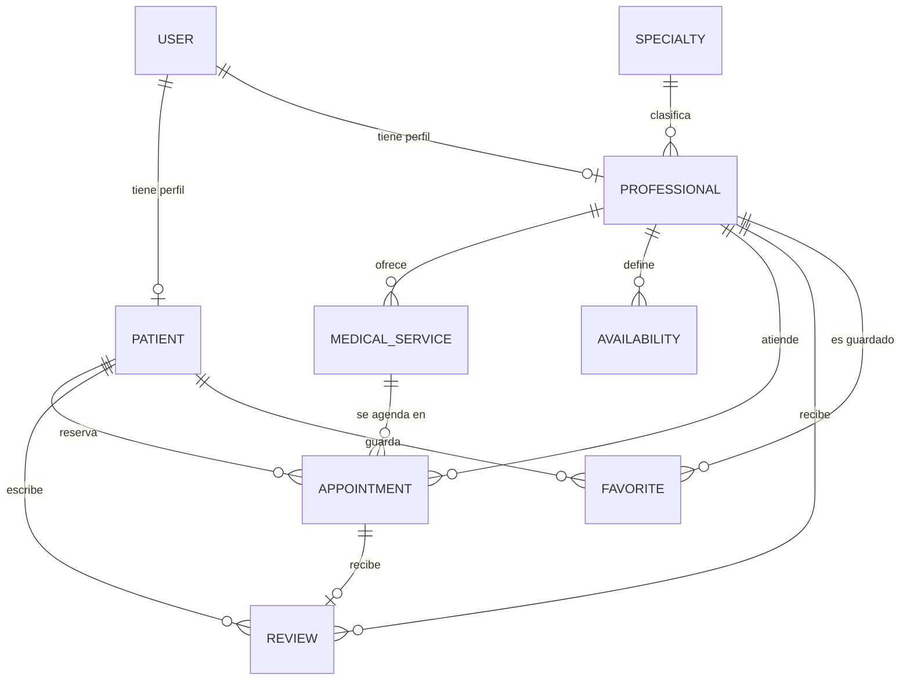

# 🩺 Salud al Toque — Backend

**Plataforma para encontrar y comparar profesionales de la salud según especialidad, precio, ubicación, disponibilidad y calificación.**

**Curso:** CS 2031 Desarrollo Basado en Plataforma

**Integrantes:**
- Alvaro David Pachas Chapeton (202510345)
- Fabricio Alberto Olaguibel Romero (202410686)
- Saul Morales Zumaeta (202010493)
- Alexander Muñoz Zamora (202210475)

**Deployment:** `[]`

<<<<<<< HEAD
=======
**Backend:** Java + Spring Boot  
**Base de datos:** PostgreSQL  
**Integrantes:** 
- Alvaro David Pachas Chapeton
- Fabricio Alberto Olaguibel Romero
- Saul Morales Zumaeta
- Alexander Muñoz Zamora
- Jhon Dayron Blas Huete  
>>>>>>> 0d1cac2 (Entrega Final)
---

## Índice

1. [Introducción](#1-introducción)
2. [Identificación del Problema](#2-identificación-del-problema)
3. [Descripción de la Solución](#3-descripción-de-la-solución)
4. [Arquitectura y Decisiones de Diseño](#4-arquitectura-y-decisiones-de-diseño)
5. [Modelo de Entidades](#5-modelo-de-entidades)
6. [Endpoints](#6-endpoints)
7. [Manejo de Errores](#7-manejo-de-errores)
8. [Medidas de Seguridad](#8-medidas-de-seguridad)
9. [Eventos y Asincronía](#9-eventos-y-asincronía)
10. [Ejecución Local y Variables de Entorno](#10-ejecución-local-y-variables-de-entorno)
11. [GitHub & Management](#11-github--management)
12. [Conclusión](#12-conclusión)
13. [Apéndices](#13-apéndices)

---

## 1. Introducción

### Contexto
En Lima, muchas personas buscan atención médica, odontológica o psicológica particular porque el sistema público está saturado. Sin embargo, la información sobre profesionales privados está dispersa entre redes sociales, recomendaciones y llamadas telefónicas, y comparar precio, ubicación y horarios es lento.

### Objetivos del Proyecto
- Permitir a pacientes buscar y filtrar profesionales por especialidad, ubicación, precio máximo y calificación mínima.
- Permitir a profesionales publicar sus servicios con precio y sus horarios de atención.
- Gestionar la reserva de citas evitando la doble reserva de un mismo horario.
- Generar confianza mediante reseñas verificadas (solo de citas completadas).
- Notificar por correo, de forma asíncrona, los eventos importantes del flujo.

## 2. Identificación del Problema

### Descripción del Problema
Los pacientes no tienen un lugar único donde comparar profesionales de salud privados según su presupuesto, cercanía y disponibilidad. A la vez, los profesionales independientes tienen dificultades para llegar a nuevos pacientes y administrar su agenda sin cruces de horario.

### Justificación
Reducir el tiempo de búsqueda de atención mejora el acceso a la salud. Un sistema de reservas con validación de disponibilidad elimina conflictos de horario, y las reseñas asociadas a citas reales ayudan a tomar decisiones informadas.

## 3. Descripción de la Solución

<<<<<<< HEAD
### Funcionalidades Implementadas
| Funcionalidad | Cómo contribuye |
=======
### Resumen técnico

| Componente | Tecnología / implementación |
|---|---|
| Lenguaje | Java |
| Framework | Spring Boot |
| API | REST |
| Persistencia | JPA / Hibernate |
| Base de datos | PostgreSQL |
| Seguridad | Spring Security + JWT |
| Testing | JUnit 5 + Mockito + MockMvc + Testcontainers |
| Notificaciones | Spring Mail + Thymeleaf + Mailpit |
| Procesamiento asíncrono | `@Async` + `ThreadPoolTaskExecutor` |


---

# 2. Identificación del Problema

## Descripción del Problema

Encontrar profesionales de la salud y coordinar una atención puede requerir consultar diferentes fuentes de información. Además, el paciente necesita conocer datos como especialidad, ubicación, servicios disponibles, precios, horarios y valoración del profesional antes de solicitar una cita.

Desde el punto de vista del profesional, también es necesario administrar sus servicios, disponibilidad y citas.

## Justificación

Salud al Toque centraliza estas operaciones en una sola plataforma. De esta manera, el paciente puede consultar profesionales y servicios y posteriormente gestionar sus citas desde el mismo sistema.

La separación entre pacientes, profesionales, servicios, disponibilidad y citas permite representar de manera estructurada las relaciones existentes en el dominio.

---

# 3. Descripción de la Solución

## Funcionalidades Implementadas

### Autenticación

El sistema permite:

- Registro de pacientes.
- Inicio de sesión.
- Generación de tokens JWT.
- Validación de tokens.
- Autorización según roles.

### Gestión de profesionales

Los usuarios pueden consultar profesionales y aplicar filtros por:

- Especialidad.
- Ubicación.
- Precio máximo.

Cada profesional está relacionado con un usuario, una especialidad y sus servicios médicos.

Los administradores pueden crear, actualizar y eliminar profesionales, validando que el usuario asociado exista y tenga rol `PROFESSIONAL`.

### Servicios médicos

Cada profesional puede administrar los servicios médicos que ofrece. Los servicios contienen:

- Nombre.
- Descripción.
- Precio.
- Profesional asociado.

El precio de un servicio se almacena también en la cita cuando esta se genera, funcionando como un registro histórico del precio utilizado en dicha reserva.

### Disponibilidad

Los profesionales pueden registrar sus horarios de atención indicando:

- Día de la semana.
- Hora de inicio.
- Hora de finalización.

### Citas

Las citas relacionan:

- Paciente.
- Profesional.
- Servicio médico.
- Fecha.
- Hora.
- Estado.
- Notas.
- Precio.

Además, se implementa una validación para evitar la duplicación de una cita para el mismo profesional, fecha y hora.

### Reseñas

Los pacientes pueden registrar reseñas asociadas a una cita completada. Las reseñas contienen una calificación y un comentario y se relacionan con el paciente, profesional y cita correspondiente.

### Favoritos

Los pacientes pueden guardar profesionales como favoritos. Se evita que un mismo paciente registre dos veces al mismo profesional como favorito mediante una restricción de unicidad.

### Eventos y procesamiento asíncrono

El backend incorpora eventos de dominio y procesamiento asíncrono para las notificaciones:

- `UserRegisteredEvent`: se publica al registrar un usuario.
- `AppointmentCreatedEvent`: se publica al crear una cita.
- `ReviewCreatedEvent`: se publica al registrar una reseña.

El procesamiento asíncrono se habilita mediante `@EnableAsync` y un `ThreadPoolTaskExecutor` dedicado a notificaciones. Los hilos del executor utilizan el prefijo `notification-`.

El flujo de negocio probado es:

```text
Paciente
  │
  ├── Sign Up
  │     └── UserRegisteredEvent → @Async → correo
  │
  ├── Sign In
  │
  └── Crear Appointment
        └── AppointmentCreatedEvent → @Async → correo
                 │
                 ▼
Profesional
  │
  ├── Sign In
  ├── Aceptar Appointment
  └── Completar Appointment
                 │
                 ▼
Paciente
  │
  └── Crear Review
        └── ReviewCreatedEvent → @Async → correo
```

La reseña se registra después de que el profesional haya completado la cita.

---

# 4. Arquitectura del Proyecto

El backend está organizado como un **monolito modular**, con separación de responsabilidades por dominio. Cada funcionalidad principal mantiene sus propios componentes de aplicación, dominio, DTO e infraestructura cuando corresponde, mientras que las preocupaciones transversales se concentran en `config`, `auth`, `event`, `notification` y el manejo global de excepciones.

## 4.1 Estructura general

```text
src/main/java/com/example/sss001/
│
├── config/
│   ├── SecurityConfig.java
│   └── AsyncConfig.java
│
├── auth/
│   ├── application/
│   ├── components/
│   ├── domain/
│   └── dto/
│
├── user/
│   ├── application/       → Controllers y entrada HTTP
│   ├── domain/            → Entidades y lógica de negocio
│   ├── dto/               → Objetos de entrada/salida de la API
│   └── infrastructure/   → Repositories y persistencia
│
├── patient/
├── professional/
├── specialty/
├── medicalservice/
├── availability/
├── appointment/
├── review/
├── favorite/
├── event/
│   ├── Events de dominio
│   └── Listeners asíncronos
│
├── notification/
│   ├── EmailService
│   └── EmailServiceImpl
│
├── exceptions/
│   ├── ConflictException
│   ├── ForbiddenException
│   └── ResourceNotFoundException
│
└── GlobalExceptionHandler.java
```

La estructura real del código sigue este esquema en los módulos principales. `auth` añade `components/` para los elementos específicos de JWT, mientras que `event` y `notification` funcionan como módulos transversales.

## 4.2 Capas y responsabilidades

| Capa | Responsabilidad | Ejemplos |
|---|---|---|
| `application` | Recibir solicitudes HTTP y coordinar la operación | `AppointmentController`, `ReviewController` |
| `domain` | Representar entidades y ejecutar operaciones de negocio | `Appointment`, `AppointmentService`, `Review` |
| `dto` | Definir los datos expuestos por la API y las solicitudes recibidas | `AppointmentDTO`, `CreateAppointmentRequest` |
| `infrastructure` | Acceso y persistencia de datos mediante Spring Data JPA | `AppointmentRepository`, `ReviewRepository` |
| `auth/components` | Generación y validación de JWT | `JwtService`, `JwtAuthorizationFilter` |
| `config` | Configuración transversal de seguridad y procesamiento asíncrono | `SecurityConfig`, `AsyncConfig` |
| `event` | Publicación y procesamiento de eventos de dominio | `AppointmentCreatedEvent`, listeners |
| `notification` | Construcción y envío de correos mediante plantillas | `EmailServiceImpl` |

El flujo habitual de una solicitud REST es:

```text
Cliente
   │
   ▼
Controller
   │
   ▼
Service / Domain
   │
   ├──────────────► Event Publisher
   │                     │
   │                     ▼
   │              @Async Listener
   │                     │
   │                     ▼
   │              Notification / Email
   │
   ▼
Repository
   │
   ▼
PostgreSQL
```

La inyección de dependencias se realiza mediante constructores, lo que reduce el acoplamiento entre componentes y facilita las pruebas unitarias con Mockito.

## 4.3 Persistencia

Las entidades del dominio se persisten mediante **JPA/Hibernate** y repositories de Spring Data. La aplicación utiliza PostgreSQL como base de datos y carga datos iniciales mediante `data.sql`.

La configuración actual utiliza `spring.jpa.hibernate.ddl-auto=create-drop`, por lo que el esquema se genera al iniciar la aplicación y se elimina al finalizar. Esta configuración es adecuada para el entorno de desarrollo/pruebas documentado, pero debería revisarse para un entorno productivo.

## 4.4 Seguridad transversal

`SecurityConfig` configura Spring Security con sesiones `STATELESS`, deshabilita CSRF para la API y registra `JwtAuthorizationFilter` antes de `UsernamePasswordAuthenticationFilter`.

El acceso se divide entre endpoints públicos y endpoints autenticados. La autorización fina por rol se complementa mediante seguridad a nivel de método con `@EnableMethodSecurity` y las restricciones `@PreAuthorize` utilizadas por los controllers.

```text
Request
   │
   ▼
JwtAuthorizationFilter
   │
   ├── Token válido ──► Usuario autenticado
   │                         │
   │                         ▼
   │                    @PreAuthorize
   │                         │
   │                    ┌────┴────┐
   │                    ▼         ▼
   │                  Permit    Deny
   │                    │         │
   │                    ▼         ▼
   │                  2xx       403
   │
   └── Sin autenticación ───────► 401
```

Las contraseñas se protegen mediante `BCryptPasswordEncoder`.

## 4.5 Eventos y procesamiento asíncrono

La arquitectura desacopla las notificaciones del flujo HTTP mediante eventos de dominio y `@Async`.

```text
Operación de negocio
       │
       ▼
Publicación del evento
       │
       ├── UserRegisteredEvent
       ├── AppointmentCreatedEvent
       └── ReviewCreatedEvent
                    │
                    ▼
          notificationExecutor
                    │
                    ▼
              EmailService
                    │
                    ▼
          Thymeleaf + SMTP
                    │
                    ▼
                Mailpit
```

`AsyncConfig` define el executor `notificationExecutor` con:

- `corePoolSize = 2`
- `maxPoolSize = 5`
- `queueCapacity = 100`
- prefijo de hilos `notification-`
- espera de tareas pendientes durante el apagado

Los listeners registran en los logs el inicio y fin del procesamiento, incluyendo el nombre del hilo. Esto permite demostrar que las notificaciones se ejecutan fuera del hilo HTTP principal.

## 4.6 Manejo transversal de errores

`GlobalExceptionHandler`, basado en `@ControllerAdvice`, centraliza el tratamiento de excepciones y mantiene respuestas HTTP consistentes.

Las excepciones de dominio principales son:

- `ResourceNotFoundException`
- `ForbiddenException`
- `ConflictException`

Esta estrategia evita repetir lógica de manejo de errores en cada controller y permite distinguir, entre otros casos, recursos inexistentes (`404`), conflictos de negocio (`409`) y problemas de autorización (`403`).

## 4.7 Ventajas de la arquitectura

La organización actual aporta:

- **Separación de responsabilidades:** cada componente tiene una función concreta.
- **Modularidad:** las funcionalidades del dominio están agrupadas por contexto.
- **Mantenibilidad:** cambios en una funcionalidad pueden concentrarse en su módulo.
- **Testabilidad:** services y repositories pueden probarse de forma aislada y los controllers mediante `MockMvc`.
- **Escalabilidad:** los eventos permiten incorporar nuevas reacciones a una operación sin acoplarlas directamente al controller.
- **Seguridad centralizada:** JWT y reglas generales se configuran desde Spring Security.

Para la presentación final, la idea central de la arquitectura puede resumirse como:

> **API REST modular + JPA/PostgreSQL + JWT/Spring Security + eventos asíncronos para notificaciones.**
# 5. Modelo de Entidades

El sistema actualmente cuenta con las siguientes entidades principales:

| Entidad | Descripción |
>>>>>>> 0d1cac2 (Entrega Final)
|---|---|
| Registro e inicio de sesión (JWT) | Acceso seguro con contraseñas cifradas y token con expiración. |
| Roles `ADMIN`, `PROFESSIONAL`, `PATIENT` | Cada actor solo ve y modifica lo que le corresponde. |
| Búsqueda con filtros (`specialty`, `location`, `maxPrice`) | Resuelve directamente la comparación de profesionales. |
| Servicios médicos con precio | El paciente conoce el costo antes de reservar; la cita guarda el precio como snapshot. |
| Disponibilidad semanal | El profesional define bloques horarios; las citas fuera de ellos se rechazan. |
| Citas con ciclo de vida | `PENDIENTE → ACEPTADA → COMPLETADA` o `RECHAZADA`. Un horario ocupado no puede reservarse de nuevo (409). |
| Reseñas | Solo sobre citas completadas propias; recalculan el rating del profesional. |
| Favoritos | El paciente guarda profesionales para volver a consultarlos. |
| Notificaciones por correo | Bienvenida, confirmación de cita al paciente y al profesional, y nueva reseña, con plantillas Thymeleaf. |

### Tecnologías Utilizadas
- **Lenguaje y framework:** Java 17, Spring Boot 4 (Web MVC, Data JPA, Security, Validation, Mail, Thymeleaf).
- **Base de datos:** PostgreSQL 16 (Docker Compose en local).
- **Seguridad:** Spring Security, JJWT 0.12, BCrypt.
- **Pruebas:** JUnit 5, Mockito, MockMvc, Testcontainers.
- **Herramientas:** Maven, Lombok, Postman, Mailpit (SMTP de desarrollo), GitHub Actions.

## 4. Arquitectura y Decisiones de Diseño

El código se organiza **por módulo de dominio** (`user`, `patient`, `professional`, `specialty`, `medicalservice`, `availability`, `appointment`, `review`, `favorite`, `auth`), y cada módulo tiene las mismas capas:

```
application/     → @RestController: recibe DTOs validados y devuelve ResponseEntity
domain/          → entidades JPA y @Service con toda la lógica de negocio
infrastructure/  → repositorios Spring Data JPA
dto/             → Request DTOs (entrada) y Response DTOs (salida, con fromEntity)
```

Decisiones principales:
- **Capas separadas:** los controllers exponen la API, los services concentran el acceso a datos y los repositorios encapsulan las consultas JPA.
- **Usuario desde el token:** el profesional o paciente se obtiene del JWT autenticado; nunca se confía en un `professionalId` o `patientId` enviado por el cliente.
- **DTOs de entrada y salida:** las respuestas nunca exponen entidades ni contraseñas.
- **Inyección por constructor** en todos los componentes; ningún componente de Spring se instancia con `new`.

## 5. Modelo de Entidades



<<<<<<< HEAD
| Entidad | Atributos principales | Notas |
|---|---|---|
| `User` | name, email (único), password (BCrypt), phone, role | Restricciones `nullable`, `unique` y `length`. |
| `Patient` | address, dateOfBirth, user | `@OneToOne` con `User`. |
| `Professional` | location, rating, user, specialty | `@OneToMany` a sus servicios médicos. |
| `Specialty` | name (único) | Catálogo administrado por ADMIN. |
| `MedicalService` | name, description, price | Pertenece a un profesional. |
| `Availability` | dayOfWeek, startTime, endTime | Bloques semanales por profesional. |
| `Appointment` | date, time, status, notes, price | Guarda el precio del servicio como snapshot. |
| `Review` | rating, comment, appointment (única) | Una reseña por cita. |
| `Favorite` | patient, professional | Restricción única `(patient_id, professional_id)`. |
=======
Las relaciones se implementan mediante anotaciones JPA como `@OneToOne`, `@OneToMany` y `@ManyToOne`.

La entidad `Favorite` incorpora además una restricción de unicidad sobre la combinación `patient_id` y `professional_id`.

---

# 6. DTOs y Mapeo

El proyecto utiliza DTOs para evitar exponer directamente las entidades JPA en los endpoints.

Entre los DTO implementados se encuentran:

- `UserDTO`
- `ProfessionalDTO`
- `PatientDTO`
- `AppointmentDTO`
- `CreateAppointmentRequest`
- `SpecialtyDTO`
- `MedicalServiceDTO`
- `AvailabilityDTO`
- `ReviewDTO`
- `CreateReviewRequest`
- `FavoriteDTO`
- `SignInRequest`
- `SignUpRequest`
- `TokenResponse`

Esta separación permite definir estructuras específicas para las solicitudes y respuestas de la API.

Por ejemplo, las contraseñas de los usuarios no forman parte de `UserDTO`, evitando exponer información sensible.

Para algunas operaciones se utiliza ModelMapper, mientras que determinadas conversiones se realizan directamente en los servicios.

---

# 7. API REST y Endpoints

La API utiliza recursos en plural y verbos HTTP de acuerdo con las operaciones realizadas.

La colección de Postman del repositorio (`Salud_al_Toque_Postman_Collection.json`) cubre todos los endpoints listados a continuación. Se recomienda ejecutar en orden los requests "Sign In - Admin", "Sign In - Professional" y "Sign In" (paciente) de la carpeta `01 - Auth` para poblar las variables `{{adminToken}}`, `{{professionalToken}}` y `{{token}}` usadas por el resto de la colección.

## Autenticación

| Método | Endpoint | Descripción | Rol |
|---|---|---|---|
| `POST` | `/auth/signup` | Registrar paciente | Público |
| `POST` | `/auth/signin` | Iniciar sesión | Público |
>>>>>>> 0d1cac2 (Entrega Final)

Las columnas obligatorias usan `nullable = false`, el email y el nombre de especialidad son únicos y los favoritos tienen restricción única `(patient_id, professional_id)`. En la capa de aplicación se valida con `@Valid`, `@NotBlank`, `@Email`, `@Pattern`, `@Min`, `@Max` y `@Size`.

<<<<<<< HEAD
## 6. Endpoints
=======
| Método | Endpoint | Descripción | Rol |
|---|---|---|---|
| `GET` | `/users` | Listar usuarios | `ADMIN` |
| `GET` | `/users/{id}` | Obtener usuario | `ADMIN` |
| `POST` | `/users` | Crear usuario | `ADMIN` |
| `DELETE` | `/users/{id}` | Eliminar usuario | `ADMIN` |
>>>>>>> 0d1cac2 (Entrega Final)

La colección completa, con ejemplos y variables, está en [`postman_collection.json`](postman_collection.json).

<<<<<<< HEAD
| Recurso | Endpoints |
=======
| Método | Endpoint | Descripción | Rol |
|---|---|---|---|
| `GET` | `/professionals` | Listar y buscar profesionales | Público |
| `GET` | `/professionals/{id}` | Obtener profesional | Público |
| `POST` | `/professionals` | Crear profesional (valida rol `PROFESSIONAL` del usuario y especialidad) | `ADMIN` |
| `PUT` | `/professionals/{id}` | Actualizar ubicación, rating y especialidad | `ADMIN` |
| `DELETE` | `/professionals/{id}` | Eliminar profesional | `ADMIN` |

Los filtros disponibles incluyen:

```text
/professionals?specialty=Cardiologia
/professionals?location=Lima
/professionals?maxPrice=80
```

También pueden combinarse.

## Pacientes

| Método | Endpoint | Descripción | Rol |
|---|---|---|---|
| `GET` | `/patients` | Consultar pacientes | `ADMIN` |
| `GET` | `/patients/{id}` | Obtener paciente | `ADMIN` |
| `POST` | `/patients` | Crear paciente | `ADMIN` |
| `DELETE` | `/patients/{id}` | Eliminar paciente | `ADMIN` |
| `GET` | `/patients/me` | Obtener información del paciente autenticado | `PATIENT` |

## Especialidades

| Método | Endpoint | Descripción | Rol |
|---|---|---|---|
| `GET` | `/specialties` | Listar especialidades | Público |
| `GET` | `/specialties/{id}` | Obtener especialidad | Público |
| `POST` | `/specialties` | Crear especialidad | `ADMIN` |
| `DELETE` | `/specialties/{id}` | Eliminar especialidad | `ADMIN` |

## Servicios médicos

| Método | Endpoint | Descripción | Rol |
|---|---|---|---|
| `GET` | `/medical-services` | Listar servicios | Público |
| `GET` | `/medical-services/{id}` | Obtener servicio | Público |
| `GET` | `/medical-services/professional/{professionalId}` | Listar servicios de un profesional | Público |
| `POST` | `/medical-services` | Crear servicio (el profesional se deriva del JWT) | `PROFESSIONAL` |
| `DELETE` | `/medical-services/{id}` | Eliminar servicio (solo el dueño) | `PROFESSIONAL` |

## Disponibilidad

| Método | Endpoint | Descripción | Rol |
|---|---|---|---|
| `GET` | `/availabilities` | Listar disponibilidades | Público |
| `GET` | `/availabilities/{id}` | Obtener disponibilidad | Público |
| `GET` | `/availabilities/professional/{professionalId}` | Listar horarios de un profesional | Público |
| `POST` | `/availabilities` | Crear disponibilidad (el profesional se deriva del JWT) | `PROFESSIONAL` |
| `DELETE` | `/availabilities/{id}` | Eliminar disponibilidad (solo el dueño) | `PROFESSIONAL` |

## Citas

| Método | Endpoint | Descripción | Rol |
|---|---|---|---|
| `GET` | `/appointments` | Listar todas las citas | `ADMIN` |
| `GET` | `/appointments/{id}` | Obtener cita | `ADMIN` |
| `GET` | `/appointments/patient/{patientId}` | Listar citas de un paciente | `ADMIN` |
| `GET` | `/appointments/professional/{professionalId}` | Listar citas de un profesional | `ADMIN` |
| `GET` | `/appointments/my-appointments` | Listar citas del paciente autenticado | `PATIENT` |
| `GET` | `/appointments/my-professional-appointments` | Listar citas del profesional autenticado | `PROFESSIONAL` |
| `POST` | `/appointments` | Crear cita (valida disponibilidad y duplicados) | `PATIENT` |
| `PATCH` | `/appointments/{id}/accept` | Aceptar una cita (`PENDIENTE` → `ACEPTADA`) | `PROFESSIONAL` |
| `PATCH` | `/appointments/{id}/reject` | Rechazar una cita (`PENDIENTE` → `RECHAZADA`) | `PROFESSIONAL` |
| `PATCH` | `/appointments/{id}/complete` | Completar una cita (`ACEPTADA` → `COMPLETADA`) | `PROFESSIONAL` |
| `DELETE` | `/appointments/{id}` | Eliminar cita | `ADMIN` |

Las operaciones de aceptación, rechazo y completado requieren el JWT del profesional:

```text
Authorization: Bearer <professionalToken>
```

El flujo es:

```text
POST /appointments
        ↓
PATCH /appointments/{id}/accept
        ↓
PATCH /appointments/{id}/complete
        ↓
POST /reviews
```

El acceso a las citas se encuentra protegido para evitar que un paciente consulte información perteneciente a otros usuarios.

## Reseñas

| Método | Endpoint | Descripción | Rol |
|---|---|---|---|
| `GET` | `/reviews` | Listar reseñas | Público |
| `GET` | `/reviews/{id}` | Obtener reseña | Público |
| `GET` | `/reviews/professional/{professionalId}` | Listar reseñas de un profesional | Público |
| `POST` | `/reviews` | Crear reseña (solo sobre cita `COMPLETADA` del propio paciente, sin reseña previa; recalcula el rating del profesional) | `PATIENT` |

## Favoritos

| Método | Endpoint | Descripción | Rol |
|---|---|---|---|
| `GET` | `/favorites/my-favorites` | Obtener favoritos del paciente autenticado | `PATIENT` |
| `POST` | `/favorites/professional/{professionalId}` | Agregar favorito (409 si ya existe) | `PATIENT` |
| `DELETE` | `/favorites/{id}` | Eliminar favorito (solo el propio) | `PATIENT` |

---

# 8. Manejo de Errores

El proyecto cuenta con un `GlobalExceptionHandler` basado en `@ControllerAdvice`.

Se implementaron excepciones personalizadas como:

- `ResourceNotFoundException`
- `ForbiddenException`
- `ConflictException`

Además, el sistema maneja excepciones de Spring Security y errores relacionados con solicitudes HTTP.

Los principales códigos utilizados son:

| Código | Significado |
>>>>>>> 0d1cac2 (Entrega Final)
|---|---|
| Auth (público) | `POST /auth/signup`, `POST /auth/signin` |
| Users (ADMIN) | `GET /users`, `GET /users/{id}`, `POST /users`, `DELETE /users/{id}` |
| Patients | PATIENT: `GET /patients/me`; ADMIN: `GET /patients`, `GET /patients/{id}`, `POST /patients`, `DELETE /patients/{id}` |
| Professionals | Público: `GET /professionals?specialty=&location=&maxPrice=`, `GET /professionals/{id}`; ADMIN: `POST`, `PUT /{id}`, `DELETE /{id}` |
| Specialties | Público: `GET`, `GET /{id}`; ADMIN: `POST`, `DELETE /{id}` |
| Medical services | Público: `GET`, `GET /{id}`, `GET /professional/{id}`; PROFESSIONAL (dueño): `POST`, `DELETE /{id}` |
| Availabilities | Público: `GET`, `GET /{id}`, `GET /professional/{id}`; PROFESSIONAL (dueño): `POST`, `DELETE /{id}` |
| Appointments | PATIENT: `POST`, `GET /my-appointments`; PROFESSIONAL: `GET /my-professional-appointments`, `PATCH /{id}/accept`, `/reject`, `/complete`; ADMIN: `GET`, `GET /{id}`, `GET /patient/{id}`, `GET /professional/{id}`, `DELETE /{id}` |
| Reviews | Público: `GET`, `GET /{id}`, `GET /professional/{id}`; PATIENT: `POST` |
| Favorites | PATIENT: `GET /my-favorites`, `POST /professional/{id}`, `DELETE /{id}` |

## 7. Manejo de Errores

Un `@RestControllerAdvice` (`GlobalExceptionHandler`) centraliza todos los errores y responde siempre con el mismo `ErrorResponseDTO`:

```json
{ "timestamp": "2026-09-25T21:00:00", "status": 409, "error": "Conflict",
  "message": "El horario seleccionado ya está reservado", "path": "/appointments", "fieldErrors": null }
```

Excepciones personalizadas, organizadas en jerarquía sobre `ApiException` (que lleva su `HttpStatus`):

| Categoría (status) | Excepciones |
|---|---|
| 400 Bad Request | `BadRequestException`, `InvalidFormatException` |
| 401 Unauthorized | `UnauthorizedException`, `InvalidTokenException` |
| 403 Forbidden | `ForbiddenException`, `ResourceOwnershipException`, `InvalidOperationException` |
| 404 Not Found | `ResourceNotFoundException` |
| 409 Conflict | `ConflictException`, `DuplicateResourceException`, `SlotUnavailableException`, `InvalidStatusTransitionException` |

También se manejan excepciones de Spring: `MethodArgumentNotValidException` (400 con `fieldErrors` por campo), `HttpMessageNotReadableException`, `MethodArgumentTypeMismatchException`, `MissingServletRequestParameterException` (400), `AuthenticationException` (401), `AccessDeniedException` (403), `NoResourceFoundException` (404), `HttpRequestMethodNotSupportedException` (405), `DataIntegrityViolationException` (409) y cualquier otra como 500, que se registra en el log sin exponer detalles internos. Los accesos sin token o sin permisos se responden con 401 y 403 desde la configuración de Spring Security.

Manejar los errores de forma global evita respuestas inconsistentes, filtra información sensible (stack traces) y permite que el frontend reaccione según el código HTTP.

## 8. Medidas de Seguridad

### Seguridad de Datos
- **Autenticación JWT stateless:** el login y el registro devuelven un token firmado (HS256) con expiración de 1 hora. `JwtAuthorizationFilter` extrae el token del header `Authorization: Bearer`, valida firma y expiración y carga el usuario con `CustomUserDetailsService`, dejándolo en el `SecurityContext`.
- **Contraseñas con BCrypt**, con política de contraseña fuerte en el registro (8–64 caracteres, letras y números) y email único.
- **Autorización por roles** guardados en BD: `@PreAuthorize` en cada endpoint sensible y, además, verificación de propiedad (un profesional solo modifica sus servicios, horarios y citas; un paciente solo sus reseñas y favoritos).
- **Configuración sensible por variables de entorno:** credenciales de BD y SMTP. `.env` no se sube al repositorio.

<<<<<<< HEAD
### Prevención de Vulnerabilidades
- **Inyección SQL:** todo el acceso a datos usa Spring Data JPA con consultas parametrizadas; no se concatena SQL.
- **Validación de entrada:** Bean Validation en los requests de autenticación, citas y reseñas; los datos inválidos se rechazan con 400.
- **CSRF:** deshabilitado de forma intencional porque la API es stateless y no usa cookies de sesión.
- **XSS:** la API solo responde JSON y las plantillas de correo Thymeleaf escapan el contenido con `th:text`.
=======
La autorización se utiliza para restringir operaciones sensibles. Por ejemplo, un paciente no puede crear disponibilidades o servicios médicos de un profesional. La colección de Postman mantiene tres tokens separados para verificar la autorización por rol en cada endpoint:

```text
token             → JWT del paciente (PATIENT)
professionalToken → JWT del profesional (PROFESSIONAL)
adminToken        → JWT del administrador (ADMIN)
```
>>>>>>> 0d1cac2 (Entrega Final)

## 9. Eventos y Asincronía

<<<<<<< HEAD
| Evento | Publicado en | Listener y efecto |
=======
La clave JWT está configurada mediante una propiedad de aplicación y está preparada para utilizar variables de entorno en la configuración.

---

# 10. Base de Datos y Ejecución

El proyecto utiliza PostgreSQL y Docker Compose para facilitar el desarrollo local.

El contenedor utilizado es:

```text
postgres:16-alpine
```

La aplicación se conecta mediante:

```properties
spring.datasource.url=jdbc:postgresql://${DB_HOST:localhost}:${DB_PORT:5434}/${DB_NAME:sss001}
```

Para iniciar la base de datos:

```bash
docker compose up -d
```

Para ejecutar el backend:

```bash
./mvnw spring-boot:run
```

También puede ejecutarse directamente desde IntelliJ IDEA.

La aplicación utiliza `data.sql` para cargar datos iniciales de prueba, incluyendo usuarios, profesionales, especialidades, servicios, disponibilidad y una cita inicial.

### Mailpit para desarrollo

Mailpit permite capturar los correos enviados por el backend sin enviarlos a destinatarios reales.

El backend envía los mensajes al SMTP local de Mailpit mediante `localhost:1025`. Esto permite verificar las notificaciones generadas por `UserRegisteredEvent`, `AppointmentCreatedEvent` y `ReviewCreatedEvent`.


---

# 11. Eventos y Procesamiento Asíncrono

El backend utiliza Spring para ejecutar los listeners de eventos en segundo plano.

### Eventos implementados

| Evento | Se dispara cuando | Procesamiento |
>>>>>>> 0d1cac2 (Entrega Final)
|---|---|---|
| `UserRegisteredEvent` | `AuthService.signUp` | Correo de bienvenida. |
| `AppointmentCreatedEvent` | creación de cita | Confirmación al paciente y aviso al profesional. |
| `ReviewCreatedEvent` | creación de reseña | Aviso al profesional de la nueva reseña. |

Los listeners usan `@EventListener` y `@Async("notificationExecutor")`. `AsyncConfig` (`@EnableAsync`) define un `ThreadPoolTaskExecutor` (2–5 hilos, cola de 100, prefijo `notification-`).

**¿Por qué asíncronos?** Enviar un correo por SMTP puede tardar segundos o fallar. Si fuera síncrono, el paciente esperaría esa latencia al reservar y un fallo del servidor de correo haría fallar la reserva. Con eventos, los services no dependen del módulo de notificaciones (bajo acoplamiento), y los errores de envío se registran sin afectar la operación principal.

## 10. Ejecución Local y Variables de Entorno

```bash
docker compose up -d                 # PostgreSQL en el puerto 5434
docker run -d -p 1025:1025 -p 8025:8025 axllent/mailpit   # correos en http://localhost:8025
./mvnw spring-boot:run               # API en http://localhost:8080
./mvnw verify                        # pruebas (requiere Docker por Testcontainers)
```

Usuarios de prueba (`data.sql`, contraseña `123456`): `admin@gmail.com`, `carlos@gmail.com` (profesional), `luis@gmail.com` (paciente).

| Variable | Uso |
|---|---|
| `DB_HOST`, `DB_PORT`, `DB_NAME`, `DB_USER`, `DB_PASSWORD` | Conexión a PostgreSQL |
| `NOTIFICATION_EMAIL_ENABLED`, `MAIL_HOST`, `MAIL_PORT`, `MAIL_USERNAME`, `MAIL_PASSWORD` | SMTP |

## 11. GitHub & Management

- **Gestión de tareas:** `[completar: describir el tablero de GitHub Projects, issues asignadas por integrante, labels y milestones por semana]`.
- **Flujo de ramas:** `[completar: ramas feature/* y pull requests hacia main con revisión]`.
- **GitHub Actions:** `[completar: describir el workflow si se configura; si no, indicarlo como trabajo futuro]`.

<<<<<<< HEAD
## 12. Conclusión

### Logros del Proyecto
Se construyó un backend completo que permite buscar y comparar profesionales, reservar citas sin conflictos de horario, gestionar su ciclo de vida, reseñar atenciones reales y recibir notificaciones asíncronas, con seguridad por roles y una API REST versionada y documentada.
=======
La carpeta `11 - Events & Async Integration Test` de la colección de Postman contiene el siguiente proceso:

```text
1. Backend reachable
2. Paciente - Sign Up
3. Paciente - Sign In
4. Crear Appointment
5. Verificar Appointment (GET /appointments/my-appointments)
6. Profesional - Sign In
7. Profesional - Accept Appointment
8. Profesional - Complete Appointment
9. Paciente - Create Review
10. Verificar Review
11. Async Evidence Checklist
```
>>>>>>> 0d1cac2 (Entrega Final)

### Aprendizajes Clave
- Separar controller, service y repository simplifica las pruebas y el mantenimiento.
- Los DTOs protegen el modelo de persistencia y evitan fugas de datos.
- La autorización no termina en el rol: también hay que verificar la propiedad de cada recurso.
- Los eventos y `@Async` desacoplan módulos y mejoran los tiempos de respuesta.

<<<<<<< HEAD
### Trabajo Futuro
- Refresh tokens y versionado de la API (`/api/v1`).
- Cancelación de citas por el paciente y filtro por calificación mínima.
- Paginación y ordenamiento en los listados.
- Documentación Swagger/OpenAPI.
- Integración con Google Maps para búsqueda por cercanía.
- Recordatorios programados de citas y subida de fotos de perfil a S3.
- Despliegue con CD automático.
=======
```text
token             → JWT del paciente
professionalToken → JWT del profesional
adminToken        → JWT del administrador
```
>>>>>>> 0d1cac2 (Entrega Final)

## 13. Apéndices

### Licencia
MIT.

<<<<<<< HEAD
### Referencias
- Documentación oficial de Spring Boot, Spring Security y Spring Data JPA — https://docs.spring.io
- JJWT — https://github.com/jwtk/jjwt
- Testcontainers — https://testcontainers.com
- OWASP Top 10 — https://owasp.org/www-project-top-ten/
- Material y laboratorios del curso CS 2031 (semanas 4 y 6).
=======
# 13. Pruebas

Durante el desarrollo se implementaron pruebas de diferentes niveles utilizando JUnit 5, Mockito, Spring Boot Test, MockMvc y Testcontainers.

Se busca que cada módulo del dominio cuente con las tres capas de pruebas cuando aplica:

- **Repository test** (`@DataJpaTest` + Testcontainers): valida las consultas derivadas y personalizadas contra una base de datos PostgreSQL real.
- **Service test** (Mockito, `@ExtendWith(MockitoExtension.class)`): valida la lógica de negocio de la capa de servicio de forma aislada, mockeando el repositorio.
- **Controller test** (`@SpringBootTest` + `MockMvc` + Testcontainers): valida los endpoints REST de punta a punta, incluyendo autenticación JWT, autorización por rol (`@PreAuthorize`) y los códigos de error (`401`, `403`, `404`, `409`).

## Pruebas por módulo

| Módulo | Repository | Service | Controller |
|---|---|---|---|
| `auth` | — | `AuthServiceTest` | — |
| `user` | `UserRepositoryTest` | `UserServiceTest` | `UserControllerTest` |
| `patient` | `PatientRepositoryTest` | `PatientServiceTest` | `PatientControllerTest` |
| `professional` | `ProfessionalRepositoryTest` | `ProfessionalServiceTest` | `ProfessionalControllerTest` |
| `specialty` | `SpecialtyRepositoryTest` | `SpecialtyServiceTest` | `SpecialtyControllerTest` |
| `medicalservice` | `MedicalServiceRepositoryTest` | `MedicalServiceManagerTest` | `MedicalServiceControllerTest` |
| `availability` | `AvailabilityRepositoryTest` | `AvailabilityServiceTest` | `AvailabilityControllerTest` |
| `appointment` | `AppointmentRepositoryTest` | `AppointmentServiceTest` | `AppointmentControllerTest` |
| `review` | `ReviewRepositoryTest` | `ReviewServiceTest` | `ReviewControllerTest` |
| `favorite` | `FavoriteRepositoryTest` | `FavoriteServiceTest` | `FavoriteControllerTest` |

Adicional: `Sss001ApplicationTests` verifica que el contexto de Spring Boot cargue correctamente.

En total, el proyecto cuenta con **30 clases de test**.

## Qué valida cada capa

- **Service tests:** casos de éxito, casos en los que el repositorio no encuentra el recurso (`Optional.empty()` / `null`), y que los métodos del servicio delegan correctamente en el repositorio (`verify(repository)...`). El caso de `ProfessionalServiceTest` cubre además las 8 combinaciones de filtros del método `search()` (especialidad, ubicación, precio máximo y sus combinaciones).
- **Repository tests:** consultas derivadas (`findByX`, `existsByX`) contra los datos sembrados en `data.sql`, así como el guardado y recuperación de nuevas entidades.
- **Controller tests:** flujo HTTP completo con JWT real generado por `JwtService`, cubriendo:
  - `401 Unauthorized` cuando no se envía token.
  - `403 Forbidden` cuando el rol autenticado no tiene permiso (`@PreAuthorize`).
  - `404 Not Found` cuando el recurso no existe.
  - `409 Conflict` / reglas de negocio (p. ej. citas duplicadas, reseñas repetidas, rating fuera de rango).
  - Casos de éxito (`200 OK`, `201 Created`).

Las pruebas utilizan PostgreSQL mediante Testcontainers para acercar el entorno de testing al entorno real de ejecución.

El objetivo de estas pruebas es verificar tanto el funcionamiento esperado como los errores de autenticación, autorización, recursos inexistentes y conflictos de negocio.

## Ejecución de las pruebas

Requiere Docker corriendo localmente (Testcontainers levanta un contenedor `postgres:16-alpine` para los tests de repository y controller).

```bash
# Ejecutar toda la suite de pruebas
./mvnw test

# Ejecutar una clase de test específica
./mvnw test -Dtest=ReviewControllerTest

# Ejecutar todas las pruebas de un módulo (repository + service + controller)
./mvnw test -Dtest=com.example.sss001.review.*

# Ejecutar varias clases puntuales
./mvnw test -Dtest=PatientServiceTest,PatientRepositoryTest,ReviewServiceTest
```

---

# 14. GitHub y Gestión del Proyecto

El desarrollo del proyecto se realiza mediante Git y GitHub.

El repositorio permite mantener el historial de cambios y organizar la evolución del backend.

La documentación del proyecto se mantiene en `README.md`, mientras que la API está documentada mediante la colección de Postman `Salud_al_Toque_Postman_Collection.json` ubicada en la raíz del repositorio, la cual cubre todos los endpoints descritos en la sección 7, con tokens separados por rol (`token`, `professionalToken`, `adminToken`) y un flujo de integración completo de eventos.

---

# 15. Conclusiones y Trabajo Futuro

## Logros del Proyecto

Se desarrolló un backend funcional para una plataforma de servicios médicos, incorporando:

- Arquitectura modular.
- Persistencia con JPA.
- PostgreSQL.
- API REST.
- DTOs.
- Autenticación JWT.
- Spring Security.
- Roles y autorización.
- Manejo global de excepciones.
- Gestión de pacientes y profesionales.
- Citas médicas.
- Servicios y disponibilidad.
- Reseñas.
- Favoritos.
- Pruebas automatizadas.
- Eventos de dominio (`UserRegisteredEvent`, `AppointmentCreatedEvent`, `ReviewCreatedEvent`).
- Procesamiento asíncrono mediante `@Async`.
- Notificaciones de desarrollo mediante Mailpit.
- Flujo de citas: creación, aceptación, rechazo y completado.
- Flujo de reseñas posterior a una cita completada.

La solución permite representar las principales operaciones del dominio de Salud al Toque y proporciona una base preparada para ser consumida por una aplicación web o móvil.

## Aprendizajes Clave

El desarrollo permitió aplicar conceptos de arquitectura en capas, persistencia con JPA, diseño de APIs REST, seguridad mediante JWT, manejo de excepciones y pruebas automatizadas.

También permitió comprender la importancia de separar las entidades de persistencia de los objetos utilizados por la API mediante DTOs.

## Trabajo Futuro

Entre las mejoras previstas se encuentran:

- Implementar paginación.
- Añadir versionado de API.
- Incorporar Swagger/OpenAPI.
- Configurar CI/CD mediante GitHub Actions.
- Incorporar un sistema más completo de administración.

---

# 16. Apéndices

## A. Licencia

Actualmente la licencia del proyecto debe ser definida por el equipo.

**Licencia:** [Completar]

## B. Referencias

- CS 2031 — Desarrollo Basado en Plataforma.
- Laboratorio Semana 04 — Testing con Spring Boot.
- Laboratorio Semana 06 — Spring Security, JWT y roles/autorización.
- Documentación oficial de Spring Boot.
- Documentación oficial de Spring Security.
- Documentación de PostgreSQL.
- Documentación de Testcontainers.

## C. Variables de Entorno

Para producción se recomienda configurar los valores sensibles mediante variables de entorno:

```text
DB_HOST
DB_PORT
DB_NAME
DB_USER
DB_PASSWORD
JWT_SECRET
JWT_EXPIRATION
MAIL_HOST
MAIL_PORT
MAIL_USERNAME
MAIL_PASSWORD
```

No se deben almacenar contraseñas, claves JWT u otras credenciales directamente en el repositorio.

---

## Estado actual del proyecto

El backend se encuentra funcional para las operaciones principales del dominio. Actualmente incorpora eventos de dominio, procesamiento asíncrono con `@Async`, notificaciones de desarrollo mediante Mailpit, estados de aceptación, rechazo y completado de citas, reseñas posteriores a citas completadas y una colección Postman que cubre la totalidad de los endpoints de la API con autorización por rol mediante tres tokens separados.
>>>>>>> 0d1cac2 (Entrega Final)
